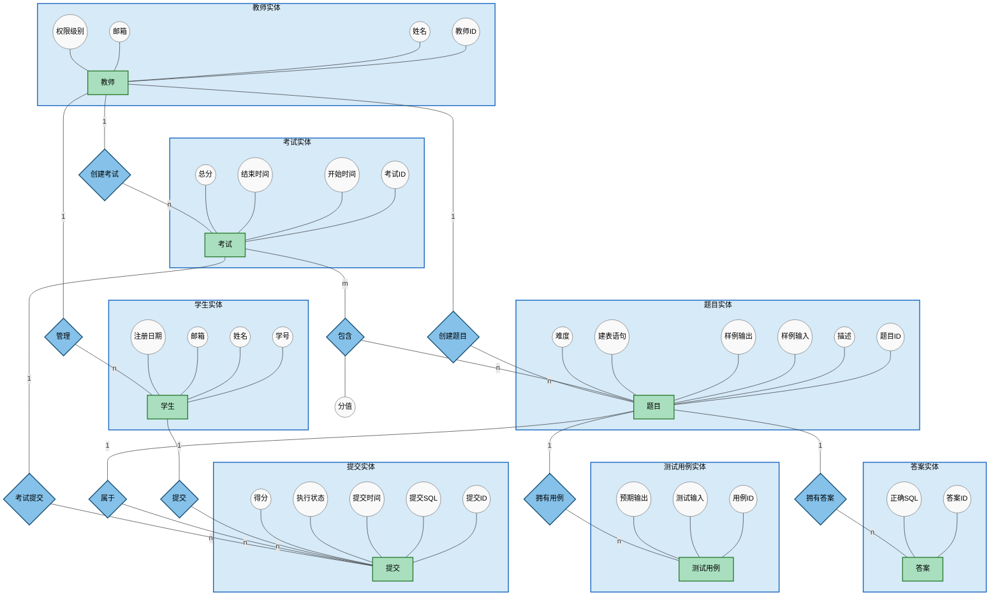

## 1. 题目介绍（1页PPT）

大家好，我们小组的选题是 **SQL课程在线测评系统**。  
这个系统为数据库课程提供**教学、练习、自动判题和考试管理**于一体的线上平台。  
它服务三种角色：  
- **学生**：在线刷题、参与考试、查看成绩与排名；  
- **教师**：管理题库、创建考试、监控学习进度；  
- **系统**：自动执行和评判用户提交的 SQL，并保证安全性。  
我们的目标是：在判题准确、安全可靠的前提下，支撑整个课程的教学与测评。

## 2. 需求分析（2页PPT）

需求分为**功能性需求**和**非功能约束**两部分。

**功能性需求**明确为五个模块：  
- **用户管理**：师生注册、登录、信息维护，教师有权限级别区分。  
- **题目管理**：教师增删改查题目，并管理其标准答案和测试用例。  
- **判题机制**：自动执行学生 SQL，对比测试用例结果；能识别错误和超时，并有安全隔离。  
- **考试与竞赛**：创建考试，设定时间、选题、分值；学生在线作答、自动计分、展示排名。  
- **统计分析**：题目完成率、学生通过率等维度生成可视化报告。

**非功能需求**强调三点：  
- **安全执行**：阻止恶意 SQL，防删库、防注入，使用沙箱或受限权限。  
- **高性能**：判题设置超时，防止慢查询拖垮系统。  
- **易用性**：界面清晰，题目展示、SQL 编写区和结果反馈自然流畅。

## 3. 数据库设计（4~5页PPT）

这部分从概念模型、逻辑结构，到完整性约束和业务规则，完整呈现数据层设计。

**3.1 概念模型——E-R图**  
我们用E-R图来呈现实体、属性和联系。主要实体有7个：

学生（Student）、教师（Teacher）、题目（Question）、答案（Answer）、测试用例（TestCase）、考试（Exam）、提交（Submission）。

几处联系：

- 教师与学生是**1:n**的管理关系；
- 题目与答案是**1:n**，一个题目允许多个正确答案；
- 题目与测试用例是**1:n**，用于多组数据的自动化验证；
- 考试与题目是**m:n**，这就需要一张中间联系——“包含”，且联系本身具有**分值**属性；
- 学生与提交是**1:n**，每次提交属于一个学生、针对一道题，并可关联到某次考试。

**3.2 逻辑模型——表结构**  
E-R 图转换成 7 张表，完全满足第三范式：  
- Student (学号, 姓名, 邮箱, 密码, 注册日期, 教师ID外键)  
- Teacher (教师ID, 姓名, 邮箱, 密码, 权限级别)  
- Question (题目ID, 描述, 样例输入输出, 建表语句, 题目难度, 教师ID)  
- Answer (答案ID, 题目ID外键, 正确SQL)  
- TestCase (用例ID, 题目ID外键, 测试输入, 预期输出)  
- Exam (考试ID, 标题, 开始时间,结束时间, 总分, 教师ID)  
- Exam_Question (考试ID, 题目ID, 分值，复合主键)  
- Submission (提交ID, 学生ID, 题目ID, 考试ID可空, 提交SQL, 时间, 执行状态, 得分)  

**3.3 完整性约束**  
为了保证数据可靠，我们从三个层面施加约束：  
- **实体完整性**：所有表均设主键，关联表 `Exam_Question` 使用复合主键防止重复。  
- **参照完整性**：所有外键都指定了级联策略。例如：删除题目时，其答案、测试用例和关联的提交会级联删除；删除考试时，提交记录仅断开连接而不丢失；删除学生则级联清除其提交记录。这让数据关系既紧密又可控。  
- **用户定义完整性**：关键字段非空、邮箱唯一，题目难度限定 `easy/medium/hard`，教师权限限定 `admin/teacher`，得分默认 0 且不能为负。

**3.4 核心业务规则**  
我们用规则进一步保证流程正确：  
- 题目必须拥有至少一个标准答案和一个测试用例才算完整。  
- 考试结束时间必须大于开始时间，且考试中题目总分应与各关联分值之和一致。  
- 判题时，系统**按测试用例严格比对真实输出**，全部通过才算正确；执行过程过滤 `DROP`、`DELETE` 等危险关键词，并使用只读数据库用户和超时机制。  
- 学生在考试期间才能提交该考试题目，成绩取最高分或最后一次提交分（根据配置）。  
- 统计分析时，题目完成率 = 至少通过一次的人数 / 做过该题的总人数；学生通过率 = 正确题目数 / 总题目数。

完整的数据设计为上层功能提供了稳定、安全的基石。


## 4. 模型图展示（E-R图页）

这就是我们严格按照规范绘制的 E-R 图。  
“包含”联系上的分值属性也单独画出。教师与学生的管理联系、题目与答案用例的拥有联系清晰明了。  
这张图完整表达了整个系统的数据视图，为后端的实现做好了充分准备。

我的部分讲解到这里，接下来由组员介绍功能设计与模块划分。谢谢！


## 附录1 数据库E-R图（Mermaid代码）



## 附录2 表结构详细清单

```sql
CREATE TABLE Teacher (
    teacher_id   INT PRIMARY KEY AUTO_INCREMENT,
    name         VARCHAR(100) NOT NULL,
    email        VARCHAR(100) UNIQUE NOT NULL,
    password_hash VARCHAR(255) NOT NULL,
    permission_level ENUM('admin','teacher') NOT NULL
);

CREATE TABLE Student (
    student_id    INT PRIMARY KEY AUTO_INCREMENT,
    name          VARCHAR(100) NOT NULL,
    email         VARCHAR(100) UNIQUE NOT NULL,
    password_hash VARCHAR(255) NOT NULL,
    registration_date DATE NOT NULL,
    teacher_id    INT,
    FOREIGN KEY (teacher_id) REFERENCES Teacher(teacher_id) ON DELETE SET NULL
);

CREATE TABLE Question (
    question_id    INT PRIMARY KEY AUTO_INCREMENT,
    description    TEXT NOT NULL,
    sample_input   TEXT,
    sample_output  TEXT,
    create_table_sql TEXT,
    difficulty     ENUM('easy','medium','hard') NOT NULL,
    teacher_id     INT,
    FOREIGN KEY (teacher_id) REFERENCES Teacher(teacher_id) ON DELETE SET NULL
);

CREATE TABLE Answer (
    answer_id   INT PRIMARY KEY AUTO_INCREMENT,
    question_id INT NOT NULL,
    correct_sql TEXT NOT NULL,
    FOREIGN KEY (question_id) REFERENCES Question(question_id) ON DELETE CASCADE
);

CREATE TABLE TestCase (
    test_case_id   INT PRIMARY KEY AUTO_INCREMENT,
    question_id    INT NOT NULL,
    test_input     TEXT,
    expected_output TEXT NOT NULL,
    FOREIGN KEY (question_id) REFERENCES Question(question_id) ON DELETE CASCADE
);

CREATE TABLE Exam (
    exam_id    INT PRIMARY KEY AUTO_INCREMENT,
    title      VARCHAR(255) NOT NULL,
    start_time DATETIME NOT NULL,
    end_time   DATETIME NOT NULL,
    total_score INT NOT NULL,
    teacher_id INT,
    FOREIGN KEY (teacher_id) REFERENCES Teacher(teacher_id) ON DELETE SET NULL
);

CREATE TABLE Exam_Question (
    exam_id     INT,
    question_id INT,
    score       INT NOT NULL,
    PRIMARY KEY (exam_id, question_id),
    FOREIGN KEY (exam_id) REFERENCES Exam(exam_id) ON DELETE CASCADE,
    FOREIGN KEY (question_id) REFERENCES Question(question_id) ON DELETE CASCADE
);

CREATE TABLE Submission (
    submission_id   INT PRIMARY KEY AUTO_INCREMENT,
    student_id      INT NOT NULL,
    question_id     INT NOT NULL,
    exam_id         INT,
    submitted_sql   TEXT NOT NULL,
    submission_time DATETIME NOT NULL,
    execution_status VARCHAR(50),
    score           INT DEFAULT 0,
    FOREIGN KEY (student_id) REFERENCES Student(student_id) ON DELETE CASCADE,
    FOREIGN KEY (question_id) REFERENCES Question(question_id) ON DELETE CASCADE,
    FOREIGN KEY (exam_id) REFERENCES Exam(exam_id) ON DELETE SET NULL
);
```
